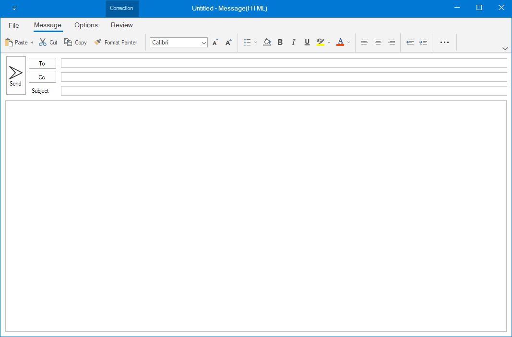

# Simplified Layout in Windows Forms Ribbon (RibbonControlAdv)

This sample demonstrates how to build a modern, space-efficient ribbon using the simplified layout in the Windows Forms RibbonControlAdv. It shows how to toggle between classic and simplified layouts, choose which commands are promoted to the primary row, manage overflow items, and keep an Office-like, familiar experience with Quick Access Toolbar and Backstage support.

## Features
- Toggle between simplified and classic ribbon layouts
- Promote frequently used commands to the primary row for quick access
- Automatic overflow menu for less frequently used commands
- Group commands using ToolStripEx and organize items by importance
- Contextual tabs, Backstage view, and Quick Access Toolbar (QAT) support
- Built-in themes and high DPI rendering
- Keyboard navigation, tooltips, and accessibility-friendly behaviors
- Localization and RTL support

## Getting Started
1. Clone this repository and open one of the provided solutions:
   - SimplifiedRibbon_2017.sln (classic .NET Framework)
   - SimplifiedRibbon_NETCore.sln (.NET Core/.NET)
2. Ensure the Syncfusion WinForms Tools package is available:
   - NuGet: Syncfusion.Tools.Windows
3. Open Form1 in the designer and add/configure a RibbonControlAdv:
   - Add RibbonTab(s) and ToolStripEx group(s)
   - Add ToolStrip items (buttons, split buttons, dropdowns, galleries, etc.)
4. Enable the simplified layout and choose which commands should appear in the primary row:
   - Mark the most important commands to be visible in simplified layout
   - Place secondary commands so they appear in the overflow menu
5. Optionally expose a UI toggle (e.g., a CheckBox, a menu item, or a custom toggle) so users can switch between simplified and classic layouts at runtime.

## Usage Tips
- Keep labels concise and rely on meaningful icons for simplified layout
- Group related commands in ToolStripEx groups; place primary actions first
- Use image sizes and text alignment that read well at compact heights
- Provide tooltips for commands that may be truncated in simplified layout
- Keep contextual tabs for task-specific commands to reduce clutter
- Use themes to match your application branding and ensure visual consistency

## About the Sample
This sample focuses on customizing which ribbon items appear in the simplified layout versus the overflow menu, and how to switch layouts interactively. Extend it by adding your own tabs, contextual tabs, QAT items, and Backstage commands to match your application’s workflow.

