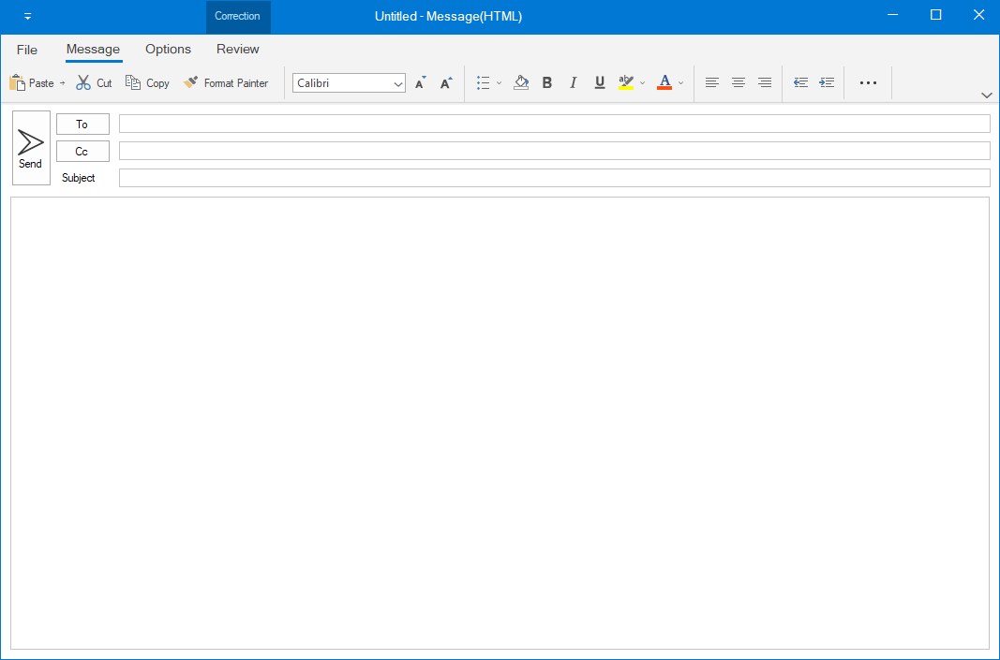

# How to customize the ribbon items within the WinForms RibbonControlAdv in simplified layout?
This repository contains samples that demonstrate how to customize the ribbon items within the WinForms [RibbonControlAdv](https://help.syncfusion.com/windowsforms/ribbon/getting-started) in [simplified layout](https://help.syncfusion.com/windowsforms/ribbon/simplifiedlayout).

